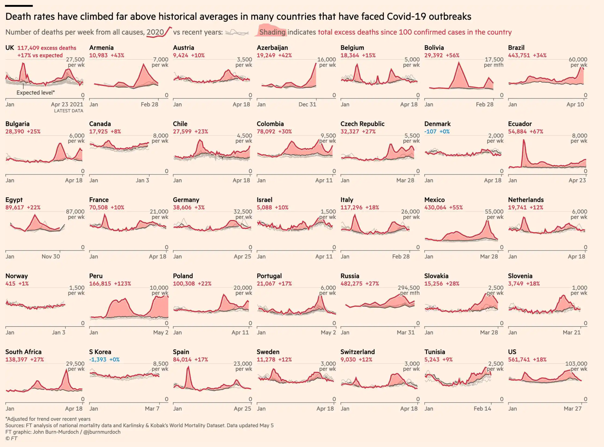
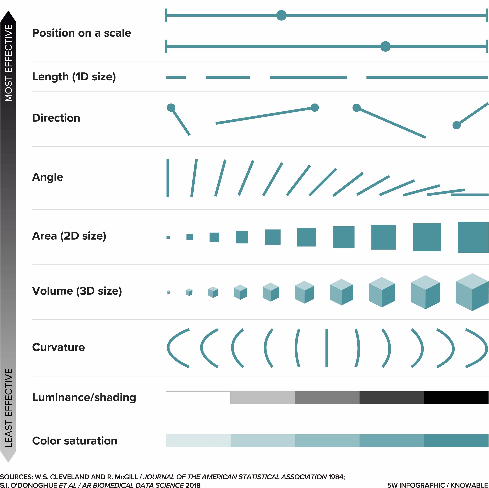
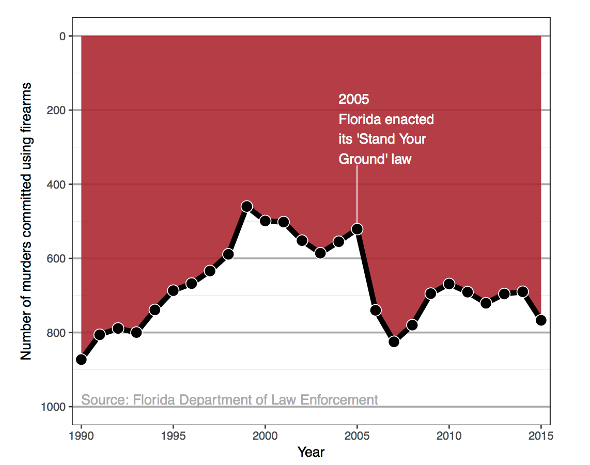
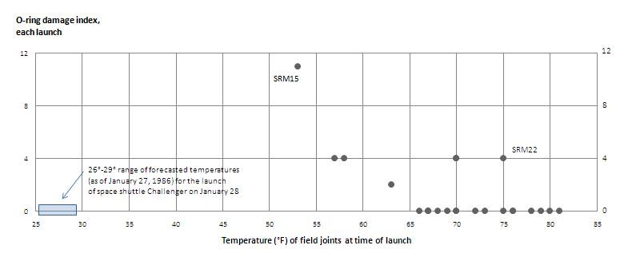

class: title-slide
background-image: url("assets/github_activity.jpeg")
background-size: contain


.left-col[
### `r rmarkdown::metadata$title`
]


---
class: middle
background-image: url("assets/TidyTuesday_Week_2020_05_Trees_in_San_Francisco.jpeg")
background-position: right
background-size: 60% 80%

.left-col2[
# Our Map

- Why we visualize data
- Telling a story and making a point
- Data is not neutral
- Share! 
]

```{r setup, include=FALSE}
options(htmltools.dir.version = FALSE)
knitr::opts_chunk$set(
  fig.width = 8, fig.asp = 0.518, fig.retina = 3, dpi = 300,
  out.width = "100%",
  cache = TRUE,
  echo = FALSE,
  message = FALSE, 
  warning = FALSE,
  hiline = TRUE
)
```

```{r include = FALSE}

library(colorblindr)
library(cowplot)
library(datasauRus)
library(forcats)
library(glue)
library(ggrepel)
library(ggtextures)
library(gt)
library(knitr)
library(lubridate)
library(openintro)
library(nycflights13)
library(patchwork)
library(scales)
library(sf)
library(tidyverse)
library(tweetrmd)
library(xaringanthemer)

xaringanExtra::use_panelset()
ggplot2::theme_set(ggplot2::theme_minimal(base_size = 16))
set.seed(1234)
```

```{r xaringan-themer, include = FALSE, warning = FALSE}


style_duo_accent(
  primary_color = "#468189",
  secondary_color = "#9DBEBB",
  inverse_header_color = "#F4E9CD",
  black_color = "#031926",
  code_highlight_color = "#F4E9CD",
  code_font_size = "24px",
  title_slide_background_color = "#9DBEBB",
  title_slide_text_color = "#F4E9CD",
  base_font_size = "24px",
  header_h1_font_size = "2.5rem",
  header_h2_font_size = "2rem",
  header_h3_font_size = "1.75rem",
  extra_css = list(
    "h1" = list("margin-block-start" = "0.4rem", 
                 "margin-block-end" = "0.4rem"),
    "h2" = list("margin-block-start" = "0.4rem", 
                 "margin-block-end" = "0.4rem"),
    "h3" = list("margin-block-start" = "0.4rem", 
                 "margin-block-end" = "0.4rem"),
    ".small" = list("font-size" = "90%"),
    ".midi" = list("font-size" = "85%"),
    ".larger" = list("font-size" = "150%"),
    ".large" = list("font-size" = "200%"),
    ".xlarge" = list("font-size" = "600%"),
    ".hand" = list("font-family" = "'Gochi Hand', cursive",
                   "font-size" = "125%"),
    ".task" = list("padding-right"    = "10px",
                   "padding-left"     = "10px",
                   "padding-top"      = "3px",
                   "padding-bottom"   = "3px",
                   "margin-bottom"    = "6px",
                   "margin-top"       = "6px",
                   "border-left"      = "solid 5px #468189",
                   "background-color" = "#9DBEBB"),
    ".pull-left" = list("width" = "49%",
                        "float" = "left"),
    ".pull-right" = list("width" = "49%",
                         "float" = "right"),
    ".pull-left-wide" = list("width" = "70%",
                             "float" = "left"),
    ".pull-right-narrow" = list("width" = "27%",
                                "float" = "right"),
    ".pull-left-narrow" = list("width" = "27%",
                               "float" = "left"),
    ".pull-right-wide" = list("width" = "70%",
                              "float" = "right") 
    )
  )
```


---
class: inverse, center, middle

# Why visualize?

--

.important[

Discover patterns that may not be obvious from numerical summaries
]

---
class: middle

```{r}
datasaurus_dozen <- datasaurus_dozen %>%
  mutate(dataset = case_when(
    dataset == "dino"       ~ "Dataset 1",
    dataset == "away"       ~ "Dataset 2",
    dataset == "h_lines"    ~ "Dataset 3",
    dataset == "v_lines"    ~ "Dataset 4",
    dataset == "x_shape"    ~ "Dataset 5",
    dataset == "star"       ~ "Dataset 6",
    dataset == "high_lines" ~ "Dataset 7",
    dataset == "dots"       ~ "Dataset 8",
    dataset == "circle"     ~ "Dataset 9",
    dataset == "bullseye"   ~ "Dataset 10",
    dataset == "slant_up"   ~ "Dataset 11",
    dataset == "slant_down" ~ "Dataset 12",
    dataset == "wide_lines" ~ "Dataset 13"
  ),
  dataset = fct_relevel(dataset, "Dataset 1", "Dataset 2", "Dataset 3", "Dataset 4", "Dataset 5", "Dataset 6", "Dataset 7", "Dataset 8", "Dataset 9", "Dataset 10", "Dataset 11", "Dataset 12", "Dataset 13")
  )
```


## For example...

.left-col[
We have 13 datasets, each with 142 observations. For each observation we have values on two variables recorded: an X and a Y.

Summary statistics for these two variables for each of the datasets is given on the right. 

How, if at all, are these 13 datasets different from each other?
]

.span-col[
```{r}
datasaurus_dozen %>%
  group_by(dataset) %>%
  summarise(
    n = n(),
    `Average x` = round(mean(x), 1),
    `Average y` = round(mean(y), 1)
  ) %>%
  kable()
```
]

---


## More summary statistics...

How, if at all, are these 13 datasets different from each other?


```{r}
datasaurus_dozen %>%
  group_by(dataset) %>%
  summarise(
    n = n(),
    `Average x` = round(mean(x), 1),
    `Average y` = round(mean(y), 1),
    `St Dev x` = round(sd(x), 1),
    `St Dev y` = round(sd(y), 1)
  ) %>%
  kable()
```


---


## Even more summary statistics...

How, if at all, are these 13 datasets different from each other?


```{r}
datasaurus_dozen %>%
  group_by(dataset) %>%
  summarise(
    n = n(),
    `Average x` = round(mean(x), 1),
    `Average y` = round(mean(y), 1),
    `St Dev x` = round(sd(x), 1),
    `St Dev y` = round(sd(y), 1),
    `Correlation` = round(cor(x, y), 1)
  ) %>%
  kable()
```


---

## Surprise! 


```{r fig.asp = 0.8, out.width = "100%"}
datasaurus_dozen %>%
  ggplot(aes(x = x, y = y, color = dataset)) +
  geom_point(show.legend = FALSE) +
  facet_wrap(~dataset) +
  scale_color_viridis_d()
```


---
class: inverse, center, middle

# Why visualize?

--

.important[
Convey information in a way that is otherwise difficult/impossible to describe
]


---
class: center 

```{r out.width = "100%"}

```
.footnote[
Source: [Financial Times](https://www.ft.com/content/a2901ce8-5eb7-4633-b89c-cbdf5b386938), 27 Aug 2021.
]

???

other answers include Generate hypotheses, Make decisions, See data in context, Expand memory, Support computational analysis, Find patterns, Tell a story, Inspire


---
class: inverse, center, middle

# Storytelling tips 


???

Most data visualization is done for the purpose of communication. We have an insight about a dataset, and we have a potential audience, and we would like to convey our insight to our audience. To communicate our insight successfully, we will have to present the audience with a clear and exciting story. 

Your goal in telling a story should be to use facts and logical reasoning to get your audience interested and excited.


```{r fonts, echo = F}
dviz_font_family <- "Myriad Pro"
dviz_font_family_bold <- "Myriad Pro Semibold"
```

```{r fxns, echo = F}

theme_dviz_hgrid <- function(font_size = 14, font_family = dviz_font_family, line_size = .5,
                            rel_small = 12/14, rel_tiny = 11/14, rel_large = 16/14,
                            colour = "grey90") {
  half_line <- font_size / 2
  
  cowplot::theme_minimal_hgrid(font_size = font_size, font_family = font_family, line_size = line_size,
                              rel_small = rel_small, rel_tiny = rel_tiny, rel_large = rel_large,
                              colour = colour)  %+replace%
    theme(
      plot.margin = margin(half_line/2, 1.5, half_line/2, 1.5),
      complete = TRUE
    )
}

theme_dviz_grid <- function(font_size = 14, font_family = dviz_font_family, line_size = .5,
                            rel_small = 12/14, rel_tiny = 11/14, rel_large = 16/14,
                            colour = "grey90") {
  half_line <- font_size / 2
  
  cowplot::theme_minimal_grid(font_size = font_size, font_family = font_family, line_size = line_size,
                              rel_small = rel_small, rel_tiny = rel_tiny, rel_large = rel_large,
                              colour = colour)  %+replace%
    theme(
      plot.margin = margin(half_line/2, 1.5, half_line/2, 1.5),
      complete = TRUE
    )
}

stamp <- function(p, color, alpha, label, family = dviz_font_family_bold,
                  clip = "on")
{
  ggdraw(p, clip = clip) +
    draw_text(paste0(label, "  "), x=1, y=1, vjust=1.1, hjust=1, size=14, angle = 0,
              color=color, alpha=alpha, family = family) +
    draw_line(c(1, 1), c(0, 1), size=2.8, color=color, alpha=alpha)
}

stamp_bad <- function(p, clip = "on") stamp(p, "#d02138", 1, "bad", clip = clip)

```


```{r}
library(tidycensus)
library(tidyverse)

census_api_key("78dcfaf5811976b448c9f980bb84853ab3874198")
##
## Median income
##

# get median income and total population size for 2010 and 2015
vars <- c("B19013_001", # Median Household Income past 12 months
          "B01003_001"  # Total Population
          )


HI_2010 <- get_acs(state = "HI",  geography = "county", year = 2010, variables = vars, geometry = FALSE)
HI_2015 <- get_acs(state = "HI",  geography = "county", year = 2015, variables = vars, geometry = FALSE)

hawaii_income <- rbind(mutate(HI_2010, year = 2010),
                       mutate(HI_2015, year = 2015)) %>%
  select(county = NAME, variable, estimate, year, GEOID) %>%
  spread(variable, estimate) %>%
  extract(county, "county", regex = "(.+) County, Hawaii") %>%
  rename(population = B01003_001, median_income = B19013_001)

```

---
class: center

## Visualizations along linear axes


```{r hawaii-income-bars-bad, include = T, echo = F}

p_income_base <- ggplot(filter(hawaii_income, year == 2015), 
                        aes(x = reorder(county, desc(median_income)), 
                            y = median_income)) +
  geom_col(fill = "#56B4E9") +
  xlab("county") +
  theme_bw() +
  theme(
    axis.ticks.x = element_blank(),
    plot.margin = margin(3, 7, 3, 1.5)
  )

p_income_bad <- p_income_base + 
  coord_cartesian(xlim = c(0.5, 5.55), ylim = c(50000, 75000), expand = FALSE) +
  scale_y_continuous(
    name = "median income (USD)", 
    breaks = 10000*(5:7),
    labels = function(x) paste0("$", scales::comma(x))
  )

stamp_bad(p_income_bad)
```


???

It is common practice to use the word "ink" to refer to any part of a visualization that deviates from the background color. This includes lines, points, shared areas, and text. In this chapter, however, we are talking primarily about shaded areas

We first consider the most common scenario, visualization of amounts along a linear scale. Figure \@ref(fig:hawaii-income-bars-bad) shows the median income in the five counties that make up the state of Hawaii. 

It is a typical figure one might encounter in a newspaper article. A quick glance at the figure suggests that the county of Hawaii is incredibly poor while the county of Honolulu is much richer than the other counties. However, this Figure is quite misleading, because human perception is such that the bar height is the key quantity we perceive when looking at this figure, not the location of the bar endpoint relative to the *y* axis.


---
class: center

## Visualizations along linear axes

Often, appropriate axes make for less exciting stories

```{r hawaii-income-bars-good, include = T, echo = F}
p_income_good <- p_income_base + 
  coord_cartesian(xlim = c(0.5, 5.55), ylim = c(0, 78000), expand = FALSE, clip = "off") +
  scale_y_continuous(
    name = "median income (USD)", 
    breaks = 20000*(0:3),
    labels = function(x) paste0("$", scales::comma(x))
  ) +
  theme(axis.line.x = element_blank())

p_income_good
```

???

While there are differences in median income between the counties, they are nowhere near as big as Figure \@ref(fig:hawaii-income-bars-bad) suggested. Overall, the median incomes in the different counties are somewhat comparable.

---
class: center

## Visualizations along linear axes 

This doesn't mean you shouldn't use bar plots in these situations! 

```{r hawaii-income-change, include = T, echo = F}
hawaii_income_diff <- select(hawaii_income, county, year, median_income) %>%
  spread(year, median_income) %>%
  mutate(income_diff = `2015` - `2010`,
         income_ratio = `2015` / `2010`)

ggplot(hawaii_income_diff, aes(x = reorder(county, desc(filter(hawaii_income, year == 2015)$median_income)),
                               y = income_diff)) + 
  geom_col(fill = "#56B4E9") +
  xlab("county") +
  scale_y_continuous(
    name = "5-year change in median income (USD)", 
    limits = c(-5000, 25000),
    expand = c(0, 0),
    labels = c("-$5,000", "$0", "$5,000", "$10,000", "$15,000", "$20,000", "$25,000")
  ) +
  theme_bw() + 
  theme(axis.ticks.x = element_blank(),
        plot.margin = margin(7, 7, 3, 1.5))
```

???

This example could suggest that bars and shaded areas are not useful to represent small changes over time or differences between conditions, since we always have to draw the whole bar or area starting from 0. However, this is not the case. It is perfectly valid to use bars or shaded areas to show **differences between conditions**, as long as we make it explicit which differences we are showing. For example, we can use bars to visualize the change in median income in Hawaiian counties from 2010 to 2015 (Figure \@ref(fig:hawaii-income-change)). For all counties except Kalawao, this change amounts to less than $5000. (Kalawao is an unusual county, with fewer than 100 inhabitants, and it can experience large swings in median income from a small number of people moving into or out of the county.) And for Hawaii County, the change is negative, i.e., the median income in 2015 was lower than it was in 2010. We represent negative values by drawing bars that go in the opposite direction, i.e., that extend from 0 down rather than up.


---
class: center

## Know your audience


```{r}
carrier_names <- 
  data.frame(carrier = c("9E", "AA", "B6", "DL", "EV", "MQ", "UA", "US", "WN", "--"),
             name= c("Endeavor", "American", "JetBlue", "Delta", "ExpressJet", "Envoy", "United",
                                    "US Airways", "Southwest", "other"))

flights_clean <- filter(flights,
                !dest %in% c("HNL", "ANC") # remove Honolulu and Anchorage because they're so far
                ) %>%
  mutate(carrier = ifelse(carrier %in% c("DL", "AA"), carrier, "--")) %>%
  left_join(carrier_names) %>%
  select(name, distance, arr_delay, dest) %>%
  na.omit()

flights_clean$name <- factor(flights_clean$name, levels = c("American", "Delta", "other"))

delay <- flights_clean %>%
  group_by(name, dest) %>%
  summarise(count = n(),
            distance = mean(distance, na.rm = TRUE),
            arr_delay = mean(arr_delay, na.rm = TRUE))

```


```{r arrival-delay-vs-distance, fig.width = 5*6/4.2, include = T, echo = F}


p_delay_distance <- ggplot(delay, aes(x = distance, y = arr_delay, color = name, fill = name)) +
  geom_point(aes(size = count), alpha = .5, pch = 21) +
  geom_smooth(data = flights_clean, aes(x = distance, y = arr_delay, color = name),
              se = FALSE, inherit.aes = FALSE, size = 0.75,
              method = 'gam', formula = y ~ s(x, bs = "cs", k = 3), show.legend = FALSE) +
  scale_x_continuous(limits = c(0, 3050),
                     expand = c(0, 0),
                     name = "distance (miles)") +
  scale_y_continuous(name = "mean arrival delay (min.)") +
  scale_size(breaks = c(4000, 8000, 12000), name = "# of flights",
             range = c(2, 8)) +
  scale_color_OkabeIto(name = "airline", darken = .2, order = c(2, 7, 1)) +
  scale_fill_OkabeIto(name = "airline", order = c(2, 7, 1)) +
  guides(color = guide_legend(order = 1),
         fill = guide_legend(override.aes = list(size = 4, alpha = .7), order = 1),
         size = guide_legend(override.aes = list(fill = "gray70"), order = 2)) +
  theme_bw() +
  theme(plot.margin = margin(3.5, 14, 3.5, 1.5))

stamp_bad(p_delay_distance) 
```

--

.tip[

Try to show too much data at once you may end up not showing anything!
]


???

I don't mean what you think I mean here. Your audience is TIRED. We're all busy, tired, overworked, and underpaid. 

With nearly limitless power of visualization, it becomes tempting to keep piling on more dimensions of data. And in fact, I see a trend in the world of data visualization to make the most complex, multi-faceted visualizations possible. These visualizations may look very impressive, but they are unlikely to convey a clear story.

---
class: center

## Know your audience


```{r mean-arrival-delay-nyc, include = T, echo = F}
flights %>% mutate(carrier = ifelse(carrier %in% c("OO", "HA", "YV", "F9", "AS", "FL", "VX"), "--", carrier)) %>%
    left_join(carrier_names) %>%
    group_by(name) -> flights_grouped

f1 = flights_grouped %>%
  summarize(mean_delay = mean(arr_delay, na.rm = TRUE)) %>%
  na.omit() %>%
  mutate(highlight = ifelse(name %in% c("Delta", "American"), "yes", "no")) %>%
  ggplot(aes(x=reorder(name, desc(mean_delay)), y=mean_delay, fill = highlight)) + 
    scale_fill_manual(values = c("#B0B0B0D0", "#BD3828D0"), guide = "none") +
    scale_y_continuous(expand = c(0, 0), name = "mean arrival delay (min.)") +
    scale_x_discrete(name = NULL) +
    geom_col() + 
    coord_flip(clip = "off") +
    theme_bw() +
    theme(
      axis.line.y = element_blank(),
      axis.ticks.y = element_blank()
    )

f2  = flights_grouped %>%
  tally() %>%
  mutate(highlight = ifelse(name %in% c("Delta", "American"), "yes", "no")) %>%
  ggplot(aes(x=reorder(name, n), y=n, fill = highlight)) + 
    scale_fill_manual(values = c("#B0B0B0D0", "#BD3828D0"), guide = "none") +
    scale_y_continuous(expand = c(0, 0), name = "number of flights") +
    scale_x_discrete(name = NULL) +
    geom_col() + 
    coord_flip(clip = "off") +
    theme_bw() +
    theme(
      axis.line.y = element_blank(),
      axis.ticks.y = element_blank()
    )

plot_grid(f1, f2, nrow = 1)
```

--

.tip[

Sometimes two simple figures are better than one!

]


---
class: center

## Use color as a tool 

.top-right-corner[
.tip[
to represent
]
]

.full-page2[
```{r include = T, echo = F, results='hide'}
# B19013_001: Median household income in the past 12 months (in 2015 Inflation-adjusted dollars)
texas_income <- get_acs(state = "TX",  geography = "county", year = 2015,
                        variables = "B19013_001", geometry = TRUE)
# EPSG:3083
# NAD83 / Texas Centric Albers Equal Area
# http://spatialreference.org/ref/epsg/3083/
texas_crs <- "+proj=aea +lat_1=27.5 +lat_2=35 +lat_0=18 +lon_0=-100 +x_0=1500000 +y_0=6000000 +ellps=GRS80 +datum=NAD83 +units=m +no_defs"

# -110, -93.5 transformed using texas_crs
texas_xlim <- c(558298.7, 2112587)

theme_dviz_map <- function(font_size = 14, line_size = .5,
                            rel_small = 12/14, rel_tiny = 11/14, rel_large = 16/14) {
  half_line <- font_size / 2
  
  cowplot::theme_map(font_size = font_size, line_size = line_size,
                           rel_small = rel_small, rel_tiny = rel_tiny, rel_large = rel_large)  %+replace%
    theme(
      # plot.margin = margin(half_line/2, 1.5, half_line/2, 1.5),
         plot.margin = margin(.5, 0, 0, 0),

      complete = TRUE
    )
}
```

```{r map-Texas-income, include = T, echo = F, eval = T, out.height="250%", dpi = 300}

texas_income %>% st_transform(crs = texas_crs) %>%
  ggplot(aes(fill = estimate)) + 
  geom_sf(color = "white") + 
  coord_sf(xlim = texas_xlim, datum = NA) +
  theme_dviz_map() + 
  scale_fill_distiller(
    palette = "Blues", type = 'seq', na.value = "grey60", direction = 1,
    name = "annual median income (USD)",
    limits = c(18000, 90000),
    breaks = 20000*c(1:4),
    labels = c("$20,000", "$40,000", "$60,000", "$80,000"),
    guide = guide_colorbar(
      direction = "horizontal",
      label.position = "bottom",
      title.position = "top",
      ticks = FALSE,
      barwidth = grid::unit(3.0, "in"),
      barheight = grid::unit(0.2, "in")
    )
  ) +
  theme(
    legend.title.align = 0.5,
    legend.text.align = 0.5,
    legend.direction = "vertical",
    legend.position = "bottom"
  ) 

```


]

---
class: center

## Use color as a tool 


.top-right-corner[
.tip[

to highlight
]
]

.full-page[

```{r popgrowth-US, fig.width = 4, fig.asp = .7, include = T, echo = F}

US_regions <- read.csv("assets/US_regions.csv", stringsAsFactors = FALSE)


US_census <- read_csv("assets/county_complete.csv")

popgrowth_df <- left_join(US_census, US_regions) %>%
    group_by(region, division, state) %>%
    summarize(pop2000 = sum(pop2000, na.rm = TRUE),
              pop2010 = sum(pop2010, na.rm = TRUE),
              popgrowth = (pop2010-pop2000)/pop2000,
              area = sum(area_2010)) %>%
    arrange(popgrowth) %>%
    ungroup() %>%
    mutate(state = factor(state, levels = state),
           region = factor(region, levels = c("West", "South", "Midwest", "Northeast")))

# make color vector in order of the state
region_colors <- c("#E69F00", "#56B4E9", "#009E73", "#F0E442")
region_colors_dark <- darken(region_colors, 0.4)

state_colors <- region_colors_dark[as.numeric(popgrowth_df$region[order(popgrowth_df$state)])]

ggplot(popgrowth_df, aes(x = state, y = 100*popgrowth, fill = region)) + 
  geom_col() + 
  scale_y_continuous(
    limits = c(-.6, 37.5), expand = c(0, 0),
    labels = scales::percent_format(accuracy = 1, scale = 1),
    name = "population growth, 2000 to 2010"
  ) +
  scale_fill_manual(values = region_colors) +
  coord_flip() + 
  theme_bw() +
  theme(axis.title.y = element_blank(),
        axis.line.y = element_blank(),
        axis.ticks.length = unit(0, "pt"),
        axis.text.y = element_text(size = 4.5, color = state_colors),
        legend.position = c(.76, .38),
        #legend.text = element_text(color = region_colors),
        legend.background = element_rect(fill = "#ffffffb0"))
```

]

---
class: center

## Use color as a tool 

.top-right-corner[
.tip[

to highlight
]
]

.full-page[
```{r popgrowth-US-highlight, fig.width = 4, fig.asp = .7, include = T, echo = F}

popgrowth_hilight <- left_join(US_census, US_regions) %>%
    group_by(region, division, state) %>%
    summarize(pop2000 = sum(pop2000, na.rm = TRUE),
              pop2010 = sum(pop2010, na.rm = TRUE),
              popgrowth = (pop2010-pop2000)/pop2000,
              area = sum(area_2010)) %>%
    arrange(popgrowth) %>%
    ungroup() %>%
    mutate(region = ifelse(state %in% c("Texas", "Louisiana"), "highlight", region)) %>%
    mutate(state = factor(state, levels = state),
           region = factor(region, levels = c("West", "South", "Midwest", "Northeast", "highlight")))

# make color and fontface vector in order of the states
region_colors_bars <- c("#D9CBBE", "#C3CDD6", "#AABCB3", "#F0EDD6", "#56B4E9")
names(region_colors_bars) = c("West", "South", "Midwest", "Northeast", "highlight")


region_colors_axis <- c(rep("gray30", 4), darken("#56B4E9", .4))
region_fontface <- c(rep("plain", 4), "bold")

state_colors <- region_colors_axis[as.numeric(popgrowth_hilight$region[order(popgrowth_hilight$state)])]
state_fontface <- region_fontface[as.numeric(popgrowth_hilight$region[order(popgrowth_hilight$state)])]

ggplot(popgrowth_hilight, aes(x = state, y = 100*popgrowth, fill = region)) + 
  geom_col() + 
  scale_y_continuous(
    limits = c(-.6, 37.5), expand = c(0, 0),
    labels = scales::percent_format(accuracy = 1, scale = 1),
    name = "population growth, 2000 to 2010"
  ) +
  scale_fill_manual(
    values = region_colors_bars,
    breaks = c("West", "South", "Midwest", "Northeast")
  ) +
  coord_flip() + 
  theme_bw() +
  theme(
    text = element_text(color = "gray30"),
    axis.text.x = element_text(color = "gray30"),
    axis.title.y = element_blank(),
    axis.line.y = element_blank(),
    axis.ticks.length = unit(0, "pt"),
    axis.text.y = element_text(
      size = 4.5, color = state_colors,
      face = state_fontface
    ),
        legend.position = c(.76, .38),
    legend.background = element_rect(fill = "#ffffffb0")
  )
```
]

---
class: center
background-image: url("assets/fontsmatter.png")
background-size: contain

???


LOL but seriously, my fonts are always a mess so if anyone has good resources for finding fonts and also using interent fonts - share! 


---
class: inverse, center, middle

# Visualization ethics

---
class: center

# Human Reality 

```{r out.width = "60%"}

```

---
class: center

## Misleading Charts

```{r out.width = "90%"}

```


---
class: center

## Misleading Charts


```{r out.width = "90%"}
knitr::include_graphics("assets/challenger.jpeg")
```

---
class: center

.top-row[

```{r out.width = "60%"}
knitr::include_graphics("assets/challenger.jpeg")
```

]

.bottom-row[
```{r out.width = "100%"}

```


]


---
class: center, middle

# Data is not neutral 


--

.tip[
It is not good enough to commit to not misleading your audience 
]

https://informationisbeautiful.net/2019/winners-of-the-world-data-visualization-prize/

---
class: center, middle 

## Visualizations that mean something

.tip[
It's OK for your visualizations to invoke feelings! 
]

https://guns.periscopic.com/ 

???


young men symmetric dancing attractive to women (nature article)


---
class: left

# Possible Considerations in Critiquing a Vizualization

- Who is the intended and unintended audience?
- Who collected, processed, and visualized the data? Was this information easy to find?
- Why was the data collected, processed, and visualized? Was this information easy to find?
- How was the data collected, processed, and visualized? Was this information easy to find?
- What is the focus? What is being left out?
- What assumptions are being made?
- What tone is being set by the aesthetics of this visualization?
- What established worldviews does this visualization support or challenge?
- What is the effect of using political borders (county, state) to group the data? 
- Does the visualization empower the audience?
- Have all steps been taken to increase benefit and reduce harm in producing and publishing this visualization?

---
class: inverse, center, middle

# Let's chat resources

---
class: left

# Favs `r emo::ji("love_letter")`

.tip[
- https://clauswilke.com/dataviz/directory-of-visualizations.html
  - This whole book!
    - [Definitely section 3!](https://clauswilke.com/dataviz/image-file-formats.html) 
- [Orange for exploratory data visualization](https://orangedatamining.com/home/interactive_data_visualization/)
- [matplotlib](https://www.machinelearningplus.com/plots/top-50-matplotlib-visualizations-the-master-plots-python/) in python  
- [biorender for graphical abstracts](https://learn.biorender.com/tutorial/designing-graphical-abstracts)
- [View you local machine as a person with alternative color vision](https://colororacle.org/)
- [Blog all about deciding on colors](https://lisacharlottemuth.com/articles)
]

---
class: center 

```{r}
tweet_screenshot(tweet_url = "https://twitter.com/CanopyRobin/status/1537344984332083200",
                 maxwidth = 350)
```


---
class: left

# Last things `r emo::ji("save")`

.tip[
- [Understading `ggplot` resolution](https://www.christophenicault.com/post/understand_size_dimension_ggplot2/)
- [High resolution figures from R](https://danieljhocking.wordpress.com/2013/03/12/high-resolution-figures-in-r/)

]


